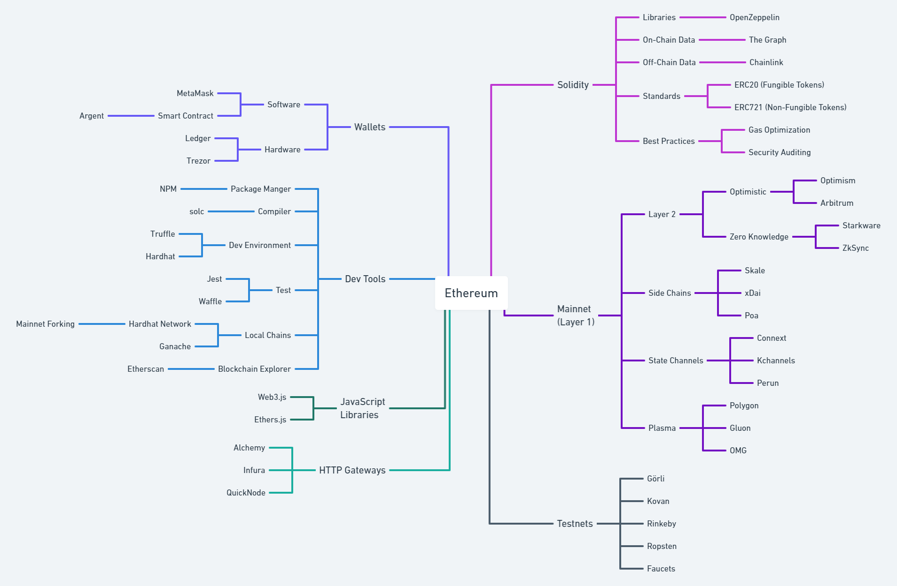

A basic introduction to Web3 and its concepts.

**This course is in progress and help is appreciated!**

## Lessons

You are **just writing JavaScript for the browser**.

There is even a small code editor that lets you **try out code right on the page**.

Every part finishes with an example app where you can apply your new knowledge right away.

### Part I: Reading Data from a Blockchain Network

The first part is about the basics, connecting to a blockchain network, reading data, etc.
You only need a modern browser and that's it.

### Part II: Writing Data to a Blockchain Network (WIP)

The second part is about getting more interactive, you will need to install a wallet extension to
your browser and create your first accounts.

## Ethereum Edition

This is the Ethereum edition, which uses the Ethereum network as an example.

The Ethereum ecosystem is a vast landscape if you're just starting out, you might be dazzled by all the networks, dev environments, wallets, and whatnot.

This introduction will help you to make sense of this all, talking about one concept per lesson.
